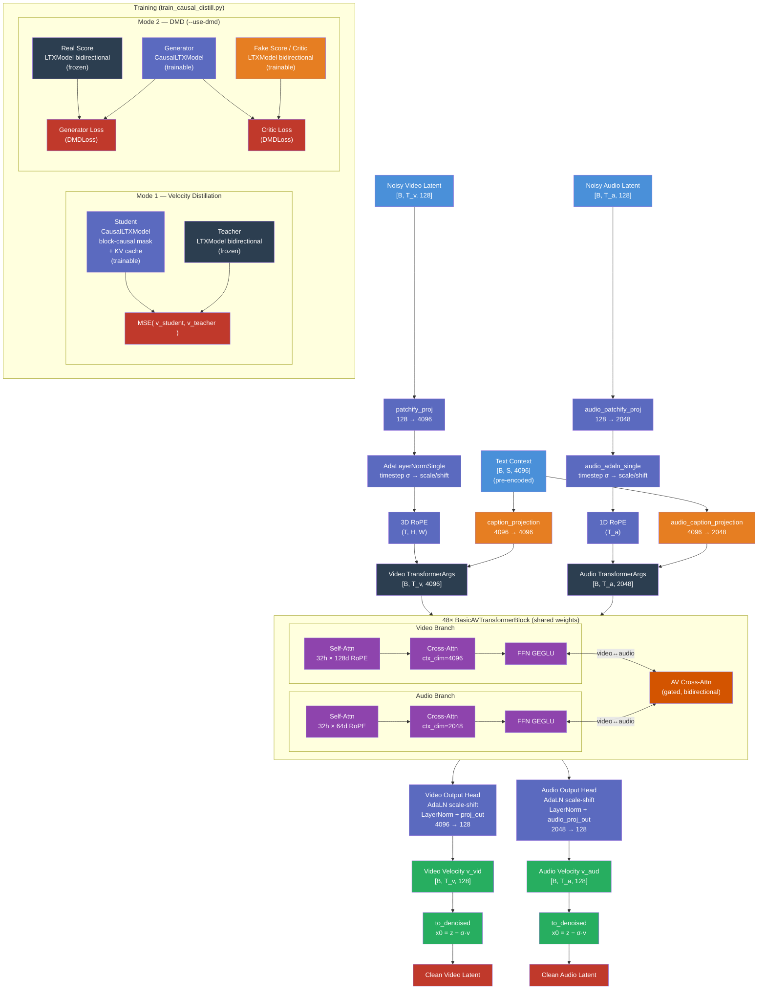

```mermaid
flowchart TD
    %% ── Inputs ──
    VZ["Noisy Video Latent\n[B, T_v, 128]"]
    AZ["Noisy Audio Latent\n[B, T_a, 128]"]
    TX["Text Context\n[B, S, 4096]\n(pre-encoded)"]

    %% ── Video preprocessing ──
    VZ --> VPATCH["patchify_proj\n128 → 4096"]
    VPATCH --> VADA["AdaLayerNormSingle\ntimestep σ → scale/shift"]
    VADA --> VROPE["3D RoPE\n(T, H, W)"]
    TX --> VCAP["caption_projection\n4096 → 4096"]
    VROPE --> VARGS["Video TransformerArgs\n[B, T_v, 4096]"]
    VCAP --> VARGS

    %% ── Audio preprocessing ──
    AZ --> APATCH["audio_patchify_proj\n128 → 2048"]
    APATCH --> AADA["audio_adaln_single\ntimestep σ → scale/shift"]
    AADA --> AROPE["1D RoPE\n(T_a)"]
    TX --> ACAP["audio_caption_projection\n4096 → 2048"]
    AROPE --> AARGS["Audio TransformerArgs\n[B, T_a, 2048]"]
    ACAP --> AARGS

    %% ── Shared Transformer ──
    VARGS --> TF
    AARGS --> TF

    subgraph TF["48× BasicAVTransformerBlock  (shared weights)"]
        direction LR
        subgraph VB["Video Branch"]
            VS1["Self-Attn\n32h × 128d  RoPE"]
            VC2["Cross-Attn\nctx_dim=4096"]
            VF["FFN  GEGLU"]
            VS1 --> VC2 --> VF
        end
        subgraph AB["Audio Branch"]
            AS1["Self-Attn\n32h × 64d  RoPE"]
            AC2["Cross-Attn\nctx_dim=2048"]
            AF["FFN  GEGLU"]
            AS1 --> AC2 --> AF
        end
        AVCA["AV Cross-Attn\n(gated, bidirectional)"]
        VF <-->|video↔audio| AVCA
        AF <-->|video↔audio| AVCA
    end

    %% ── Output heads ──
    TF --> VOUT["Video Output Head\nAdaLN scale-shift\nLayerNorm + proj_out\n4096 → 128"]
    TF --> AOUT["Audio Output Head\nAdaLN scale-shift\nLayerNorm + audio_proj_out\n2048 → 128"]

    VOUT --> VV["Video Velocity v_vid\n[B, T_v, 128]"]
    AOUT --> AV["Audio Velocity v_aud\n[B, T_a, 128]"]

    VV --> DENV["to_denoised\nx0 = z − σ·v"]
    AV --> DENA["to_denoised\nx0 = z − σ·v"]

    DENV --> XVID["Clean Video Latent"]
    DENA --> XAUD["Clean Audio Latent"]

    %% ── Training modes ──
    subgraph TRAIN["Training  (train_causal_distill.py)"]
        direction LR
        subgraph VD["Mode 1 — Velocity Distillation"]
            STU["Student\nCausalLTXModel\nblock-causal mask\n+ KV cache\n(trainable)"]
            TEA["Teacher\nLTXModel bidirectional\n(frozen)"]
            VLOSS["MSE( v_student, v_teacher )"]
            STU --> VLOSS
            TEA --> VLOSS
        end
        subgraph DMD["Mode 2 — DMD  (--use-dmd)"]
            GEN["Generator\nCausalLTXModel\n(trainable)"]
            RSCO["Real Score\nLTXModel bidirectional\n(frozen)"]
            FSCO["Fake Score / Critic\nLTXModel bidirectional\n(trainable)"]
            GLOSS["Generator Loss\n(DMDLoss)"]
            CLOSS["Critic Loss\n(DMDLoss)"]
            GEN --> GLOSS
            RSCO --> GLOSS
            FSCO --> CLOSS
            GEN --> CLOSS
        end
    end

    style VZ fill:#4a90d9,color:#fff
    style AZ fill:#4a90d9,color:#fff
    style TX fill:#4a90d9,color:#fff
    style VPATCH fill:#5b6abf,color:#fff
    style APATCH fill:#5b6abf,color:#fff
    style VADA fill:#5b6abf,color:#fff
    style AADA fill:#5b6abf,color:#fff
    style VROPE fill:#5b6abf,color:#fff
    style AROPE fill:#5b6abf,color:#fff
    style VCAP fill:#e67e22,color:#fff
    style ACAP fill:#e67e22,color:#fff
    style VARGS fill:#2c3e50,color:#fff
    style AARGS fill:#2c3e50,color:#fff
    style VS1 fill:#8e44ad,color:#fff
    style VC2 fill:#8e44ad,color:#fff
    style VF fill:#8e44ad,color:#fff
    style AS1 fill:#8e44ad,color:#fff
    style AC2 fill:#8e44ad,color:#fff
    style AF fill:#8e44ad,color:#fff
    style AVCA fill:#d35400,color:#fff
    style VOUT fill:#5b6abf,color:#fff
    style AOUT fill:#5b6abf,color:#fff
    style VV fill:#27ae60,color:#fff
    style AV fill:#27ae60,color:#fff
    style DENV fill:#27ae60,color:#fff
    style DENA fill:#27ae60,color:#fff
    style XVID fill:#c0392b,color:#fff
    style XAUD fill:#c0392b,color:#fff
    style STU fill:#5b6abf,color:#fff
    style TEA fill:#2c3e50,color:#fff
    style VLOSS fill:#c0392b,color:#fff
    style GEN fill:#5b6abf,color:#fff
    style RSCO fill:#2c3e50,color:#fff
    style FSCO fill:#e67e22,color:#fff
    style GLOSS fill:#c0392b,color:#fff
    style CLOSS fill:#c0392b,color:#fff
```
